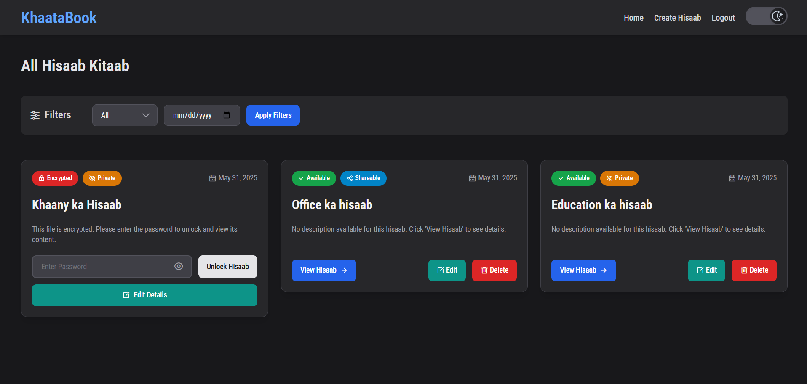

# 📖 KhaataBook - Your Digital Ledger Companion

**KhaataBook** is a modern, intuitive, and secure digital ledger application designed to help you effortlessly manage your financial records, personal notes, or any "hisaab-kitaab." Say goodbye to traditional paper ledgers and embrace the convenience of digital record-keeping with features like social authentication, encryption passwords, and a delightful user experience.

---

## ✨ Key Features

* 🔐 **Flexible User Authentication:**
    * Secure registration and login system with traditional email and password.
    * Seamless **Sign in or up with Google** for quick and easy access.
* 🔑 **Password Reset:** Functionality to reset forgotten passwords using email and username verification for traditional accounts.
* ✍️ **CRUD Operations:** Easily **C**reate, **R**ead (View), **U**pdate (Edit), and **D**elete your hisaabs (records).
* 🛡️ **Data Encryption:** Option to encrypt sensitive hisaabs with a password for enhanced privacy.
* 🔍 **Filtering & Sorting:**
    * Filter records by specific dates.
    * Sort records (e.g., All, Newest First, Oldest First) for better organization.
* 🌓 **Dark/Light Mode:** Seamless theme toggling for comfortable viewing in any lighting condition, with preferences saved.
* 📱 **Responsive Design:** Fully responsive interface that adapts beautifully to desktops, tablets, and mobile devices.
* 📄 **Intuitive UI/UX:** Clean, modern, and user-friendly design focusing on an effortless and enjoyable experience.
* 💨 **Real-time Feedback:** Interactive elements like password strength indicators during registration and clear status messages.

---

## 🚀 Live Demo

Experience KhaataBook live and see its features in action:
**[https://khaatabook-uqvq.onrender.com/](https://khaatabook-uqvq.onrender.com/)**

---

## 🛠️ Technology Stack

This project is built with a robust and modern technology stack:

* **Frontend:**
    * EJS (Embedded JavaScript templates) for dynamic HTML rendering.
    * Tailwind CSS (A utility-first CSS framework for rapid UI development).
    * Vanilla JavaScript (For client-side interactivity and dynamic features).
    * Remixicon (A comprehensive set of open-source icons).
* **Backend:**
    * Node.js (JavaScript runtime environment).
    * Express.js (Fast, unopinionated, minimalist web framework for Node.js).
    * MongoDB (NoSQL database for storing application data).
    * Mongoose (ODM - Object Data Modeling library for MongoDB and Node.js).
    * `express-session` & `connect-mongo` (For managing user sessions).
    * `passport` & `passport-google-oauth20` (For implementing Google OAuth 2.0 authentication).
* **Deployment:**
    * Render (Cloud application hosting platform).

---

## 🚀 Usage Walkthrough

1.  **Register / Sign Up:**
    * Navigate to the `/register` page.
    * **Option 1 (Email):** Create a new account by providing your full name, a valid email address, and a strong password (meeting the specified criteria).
    * **Option 2 (Google):** Click the "Sign up with Google" button to securely create an account using your existing Google profile.
2.  **Login / Sign In:**
    * Go to the `/login` page.
    * **Option 1 (Email):** Access your KhaataBook dashboard using your registered email and password.
    * **Option 2 (Google):** Click the "Sign in with Google" button for one-click access to your dashboard.
3.  **Password Reset (if needed):** For accounts created with email, if you forget your password, use the "Forgot Password" link. You'll be asked to provide your email and username to initiate the reset process.
4.  **Dashboard (Home Page):**
    * View a list of all your created "hisaabs."
    * Utilize the filter options to sort by date or view records based on their creation time (Newest/Oldest).
5.  **Create Hisaab:**
    * Click the "Create Hisaab" link in the navigation.
    * Fill in the form with a unique filename, a descriptive title, and the main content for your hisaab.
    * Choose whether to make the hisaab shareable.
    * Opt to encrypt the hisaab by checking the "Encrypted File?" box and providing a secure password (minimum 5 characters).
6.  **View Hisaab:**
    * Click on a hisaab title from the dashboard.
    * If the hisaab is encrypted, you will be prompted to enter the correct password to unlock and view its content.
    * The page displays the hisaab's title, detailed content, creation date, and status (encrypted/shareable).
7.  **Edit Hisaab:**
    * From the "View Hisaab" page, click the "Edit" button.
    * You can modify the hisaab's title, its content, and its shareable/encrypted status.
8.  **Delete Hisaab:**
    * Hisaabs can be deleted from the "View Hisaab" page. A confirmation prompt will appear to prevent accidental deletions.
9.  **Theme Toggle:**
    * Easily switch between Light and Dark visual modes using the theme toggle switch located in the navigation bar. Your preference is saved in local storage.

---

## 🙏 Acknowledgements

* **Tailwind CSS:** For the utility-first CSS framework.
* **Remixicon:** For the beautiful icon set.
* **Google Fonts:** For the "Roboto Condensed" font.
* **Passport.js:** For making authentication straightforward.
* **Node.js & Express.js:** For the powerful backend foundation.
* **Render:** For providing a platform to host and share this project.

---

Thank you for checking out KhaataBook! We hope you find it useful.
